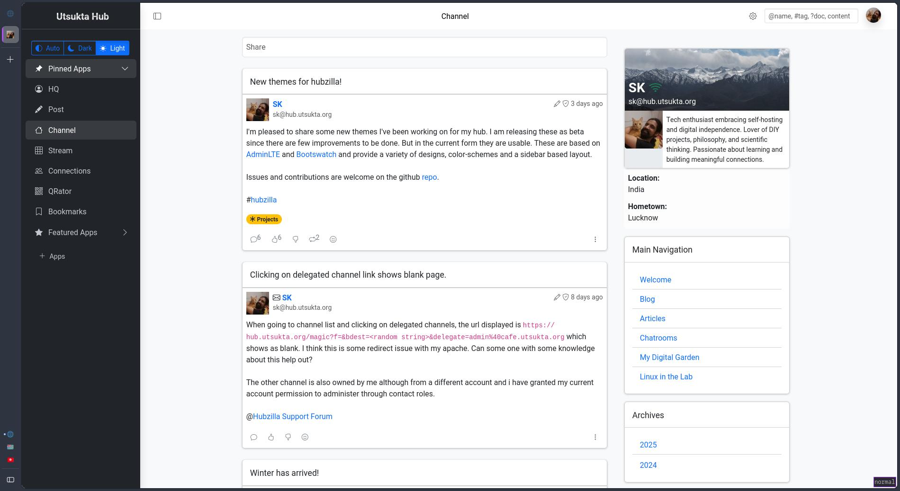
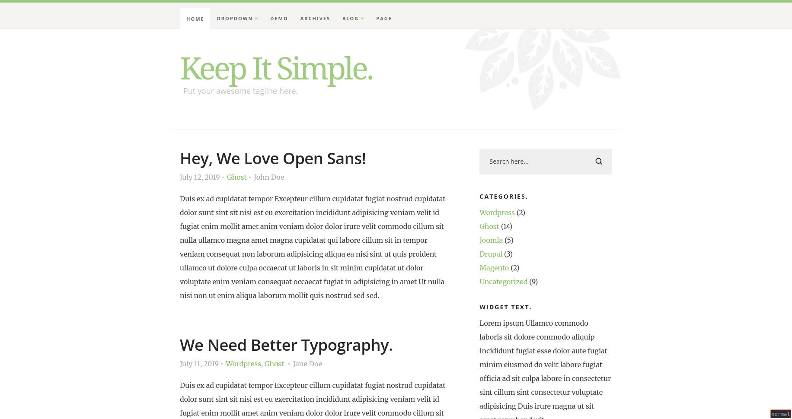
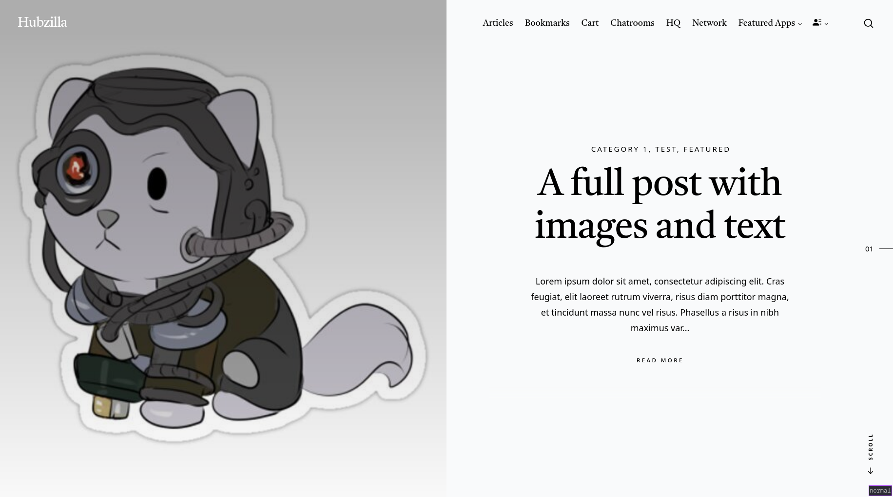
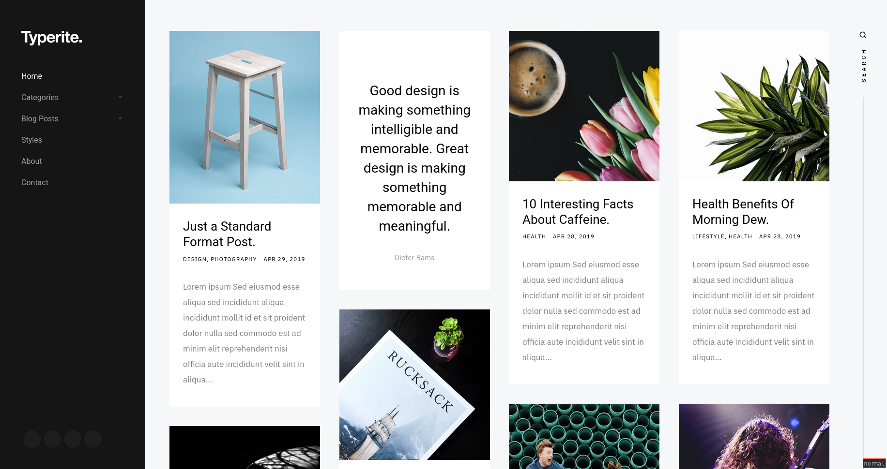

# Utsukta Hub themes

A collection of custom themes developed for hubzilla:

## How to install

Run the following in hubzilla folder on your webserver:

```
./util/add_theme_repo https://github.com/saiwal/Utsukta-hub-themes.git utsukta-themes
```

or manually extract the release in `view/themes`

## Themes

### 1. [AdminLTE4](./adminlte/README.md)



### 2. [KeepItSimple](./keepitsimple/README.md)



### 3. [LCARS](./lcars/README.md)


### 4. [Spurgeon](./spurgeon/README.md)



### 5. [Typerite](./typerite/README.md)


