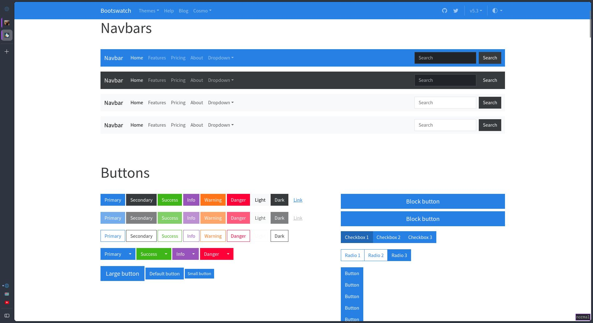
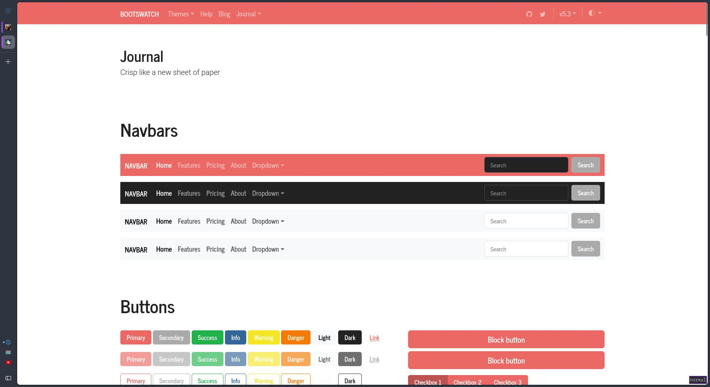
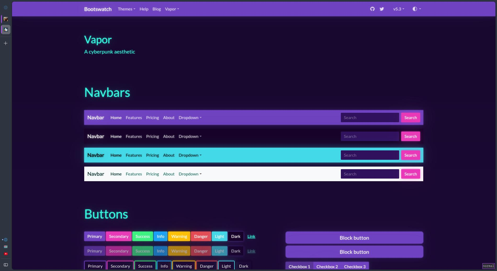

# Utsukta Hub themes

A collection of custom themes developed for hubzilla:

## How to install

run the following in hubzilla folder on your webserver:

```
./util/add_theme_repo https://github.com/saiwal/Utsukta-hub-themes.git utsukta-themes
```

or manually extract the release in `view/themes`

## Themes

### AdminLTE4

A simple, elegant and clean theme based on [AdminLTE](https://adminlte.io/)

- This theme is in very early development stage and some functionality may be broken/missing. Report any issues in the [github repo](https://github.com/saiwal/hubzilla-themes).
- Based on [AdminLTEv4](https://adminlte.io/).
- Built completely from the ground up.
- Mobile friendly and responsive.

**Demo available [here](https://hub.utsukta.org/channel/adminlte)**

Some [Screenshots](/adminlte/screenshots/screenshots.md)

### Cosmo

Based on AdminLTE and uses [Bootswatch cosmo](https://bootswatch.com/cosmo/) for a unique look.


### Journal

Based on AdminLTE and uses [Bootswatch Journal](https://bootswatch.com/journal/) for a unique look.


### Vapor

Based on AdminLTE and uses [Bootswatch vapor](https://bootswatch.com/vapor/) for a unique look.

