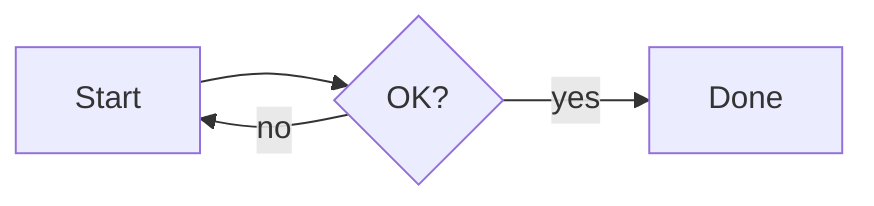
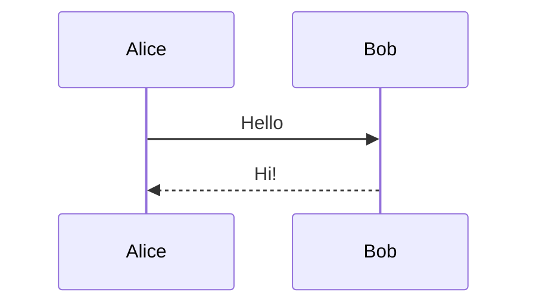
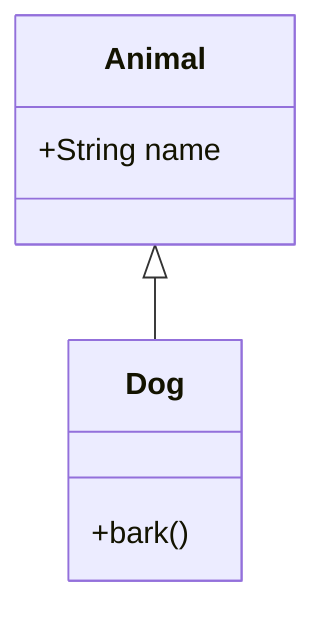
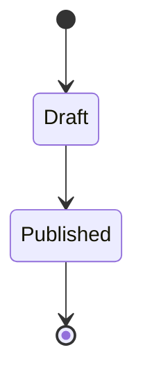
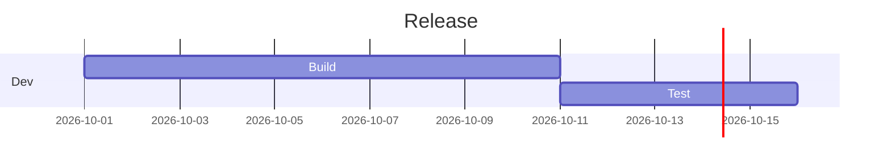
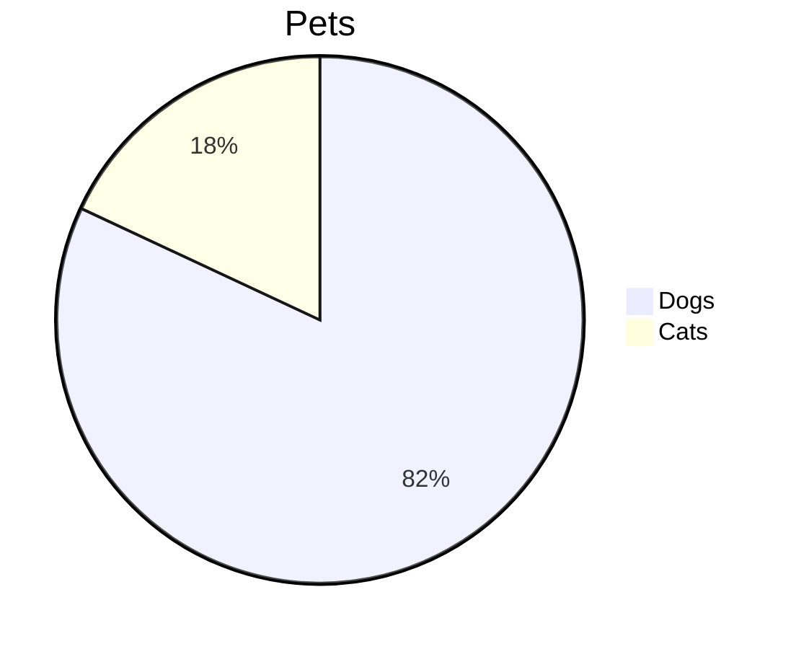
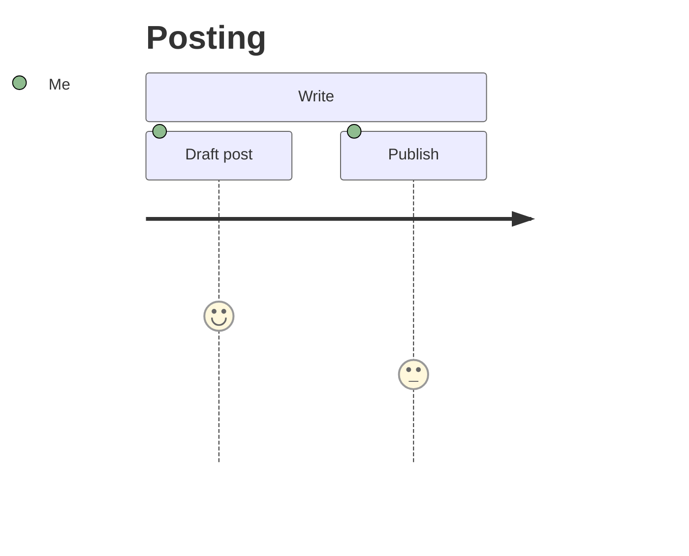
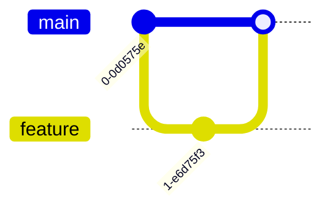

# Diagrams

You can draw flowcharts, sequence diagrams, charts and more by writing them as text. Solidified uses [Mermaid](https://mermaid.js.org/) to turn that text into a picture when the page is shown.

## Where diagrams work

- **Wiki** pages (Markdown and BBCode wikis)
- **Articles**
- **Cards**
- **Webpages**
- **Notepad**

Typed into a post as a code block, a diagram is **not** drawn in the Network stream or on channel posts — there it shows as code. Use the diagram button instead (below).

## The diagram button

Turn it on in **Settings → Features**, under **Editor → Diagrams** (it's off by default; **LaTeX equations** sits next to it). The editor toolbar then gets a diagram button that opens a window where you type the diagram and see a live preview.

- **Posts, comments and direct messages:** the diagram is turned into a picture and uploaded, like a LaTeX equation. Everyone sees the picture, even on other hubs and on Mastodon. The diagram's text goes underneath in a collapsed **Diagram source** section, so you or anyone else can copy it, change it and insert it again.
- **Wiki, articles, cards, webpages and notepad:** the button inserts the diagram as text, which is drawn every time the page is shown. You can edit it directly later.

The setting only controls the button. Diagrams other people wrote always show, whether you have it on or not.

## Writing a diagram

Put the diagram inside a code block marked `mermaid`.

**Markdown:**

````

````

**BBCode:**

```
[code=mermaid]
flowchart LR
    A[Start] --> B{OK?}
    B -->|yes| C[Done]
    B -->|no| A
[/code]
```

The first line of the block says which kind of diagram it is.

## Diagram types

| Type | First line | Good for |
|---|---|---|
| Flowchart | `flowchart LR` (or `graph TD`) | Processes, decisions |
| Sequence diagram | `sequenceDiagram` | Who sends what to whom, in order |
| Class diagram | `classDiagram` | Data structures and how they relate |
| State diagram | `stateDiagram-v2` | Things that move between states |
| Gantt chart | `gantt` | Project schedules |
| Pie chart | `pie` | Shares of a whole |
| User journey | `journey` | Steps a person goes through, scored |
| Git graph | `gitGraph` | Branches and merges |

### Sequence diagram

````

````

### Class diagram

````

````

### State diagram

````

````

### Gantt chart

````

````

### Pie chart

````

````

### User journey

````

````

### Git graph

````

````

The full syntax for every type is in the [Mermaid documentation](https://mermaid.js.org/intro/syntax-reference.html).

## Good to know

- **A mistake only breaks that diagram.** If the text has a syntax error, that block shows Mermaid's error picture; the rest of the page is unaffected. Edit the page and fix the text.
- **Other hubs and apps see the text.** Someone reading your page in classic Hubzilla, or on another server, sees the diagram's source as a code block, not the picture.
- **Colours follow your theme when the page loads.** If you switch between a light and dark theme, reload the page to recolour diagrams already on screen.
- **First diagram takes a moment.** The drawing code is only downloaded the first time you open a page with a diagram, so pages without one stay fast.

For hand-drawn sketches instead of text, see [Excalidraw](excalidraw).
