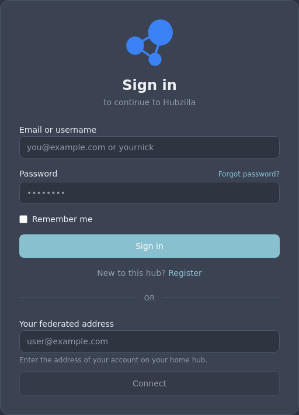
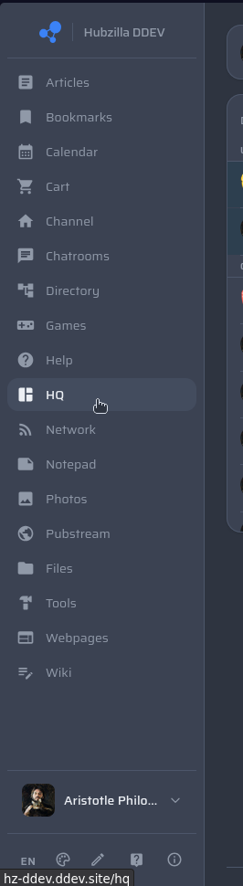
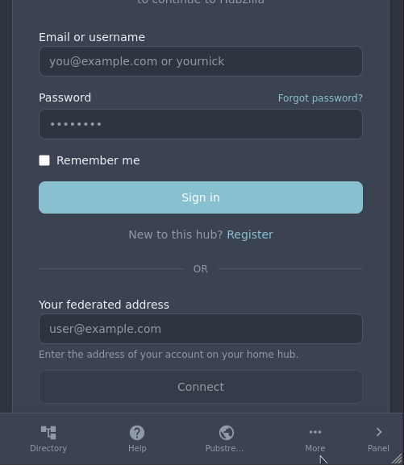
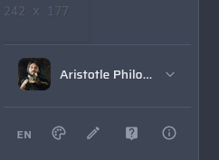
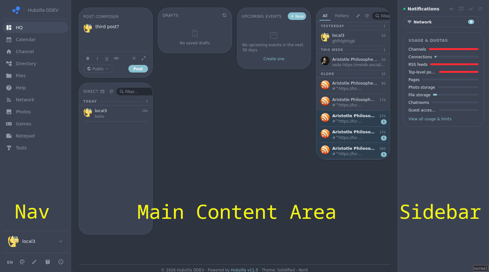
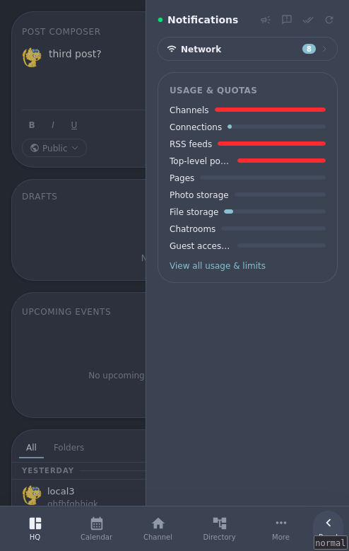

# Getting Started

## Logging In

Go to `/login` and enter your email-address/username and password. If the site allows it, you can also use remote login (OWA) to authenticate from another federated server.

After logging in, you are taken to your **HQ** - your personal dashboard.

## The Layout

The interface has three main regions:

### Left Sidebar (Desktop)

Your navigation menu. Shows your pinned apps and quick-access links. 

On smaller screens this collapses down with few items visible - use the more menu icon to open it.

In addition to the module navigation items user menu is also available for accessing settings, channels and logging out. Below the user menu are shortcuts for interface language, color scheme chooser, layout editor, contextual help and siteinfo.

### Main Content Area
The centre of the page. This is where pages, streams, and content are displayed.

### Right Sidebar (Desktop)
Context-sensitive widgets — notifications, upcoming events, and module-specific helpers appear here depending on which page you are on. On your own pages you can add, remove, reorder, and configure these — see [widgets](./widgets).

## Mobile Layout

On phones and small tablets, the interface switches to a single-column layout:
- A **bottom tab bar** gives quick access to your most-used sections.
- The left sidebar slides in from the left when you tap the menu icon.
- The right sidebar is hidden; widgets appear inline.

## Navigation

Your nav list shows apps and sections relevant to your current context:

| Context | What you see |
|---------|-------------|
| Your own channel | Your pinned apps + featured installed apps |
| Someone else's channel | That channel's tabs only |
| Logged out / visitor | Public apps and site pages |

**Action menu items** (Settings, Manage Channels, Logout) appear at the bottom of the left sidebar or in a dropdown — look for your avatar or account icon.

![IMAGE: Account menu / action items]

## Switching Channels

If you manage more than one channel, go to **Manage Channels** (`/manage`) to switch between them. Each channel has its own stream, profile, and content.

## Changing the Language

Open **Settings → Display** and look for the language or locale option. Your choice is saved locally in your browser.
