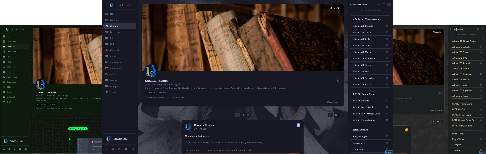

# Hubzilla *Solidified* - User Guide

Welcome to Hubzilla *Solidified* - a fast, modern interface for your Hubzilla hub. Same channel, same connections, same federated network underneath. A completely reimagined way to use it on top.

## What is Solidified?

Solidified replaces the classic page-reload interface with a single-page app: pages switch instantly, your feed updates in the background, and the whole thing works offline-capable as an installable app on your phone or desktop.

A few things you'll notice right away:

- **It's fast.** Navigating between HQ, Network, and your channel doesn't reload the page - recently viewed content appears instantly from cache while fresh data loads behind it.
- **It's yours to arrange.** Widgets can be added, removed, reordered, or placed in the sidebar, header or footer - your layout follows you across devices.
- **It looks the way you want.** 24 built-in themes (Nord, Dracula, Catppuccin, Tokyo Night, and more) plus a fully custom mode, switchable in one tap with no page flash.
- **It's still Hubzilla.** Every post, comment, photo, and message federates exactly as it always has. Solidified is a new front door, not a new back end.

## Where to start

New here? Read [Getting-started](getting-started) first — it covers logging in, the overall layout, and how navigation works, and every other page in this guide builds on it.

## Contents

- [Getting-started](getting-started): Logging in, layout overview, navigation
- [Nav](nav) — What each nav link, account-menu item, and mobile button does
- [Hq](hq) — Your HQ dashboard: composer, events, messages, drafts
- [Network](network) — Network stream: filters, view modes, searching
- [Inbox](inbox) — Mail-style message reader, and reading offline
- [Channel](channel) — Channel and profile pages
- [Composing-posts](composing-posts) — Writing posts, formatting, privacy controls, reactions
- [Photos](photos) — Photo albums and image viewer
- [Files](files) — Cloud file storage
- [Articles](articles) — Articles app: writing and reading long-form content
- [Cards](cards) — Cards app: short notes, decks, and kanban boards
- [Wiki](wiki) — Wiki: collaborative pages
- [Calendar](calendar) — Calendar and events
- [Chat](chat) — Chatrooms
- [Webpages](webpages) — Webpages app: static pages on your channel
- [Cart](cart) — Shopping cart: browsing, checkout, and order history
- [Notepad](notepad) — Notes: private personal scratchpad
- [Connections](connections) — Connections, directory, privacy groups
- [Notifications](notifications) — Notification bell and notification list
- [Widgets](widgets) — Customizing sidebar widgets: adding, removing, reordering, pinned widgets
- [Settings](settings) — All settings: display, profile, privacy, notifications, account
- [Games](games) — Puzzle games: overview, controls, and per-game descriptions
- [Excalidraw](excalidraw) — Hand-drawn-style whiteboard for sketches and diagrams

## Quick Tips

- Your **HQ** is your personal home base — start here after logging in.
- The **Network** shows everything happening across your connections.
- Use the **filter bar** on the Network page to find exactly what you need.
- All settings are at settings` — accessible from the account menu (top right or bottom of the left sidebar).
